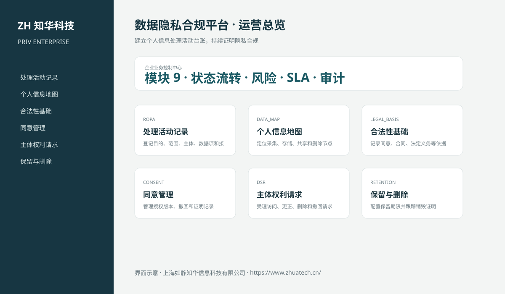
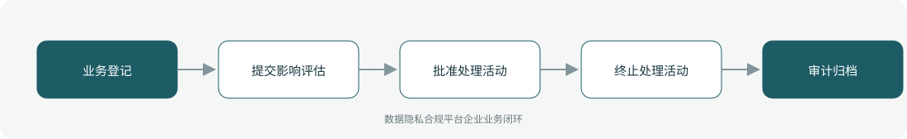

# ZhuaTech PRIV｜数据隐私合规平台

> 建立个人信息处理活动台账，持续证明隐私合规

ZhuaTech PRIV 是知华科技（上海如静知华信息科技有限公司）发布的企业级源码项目，面向“处理活动、数据地图、合法性基础、同意、主体请求、保留、跨境、评估与事件”提供管理端与响应式业务端。工程采用前后端分离架构，所有示例数据均为虚构数据。

[知华科技官网](https://www.zhuatech.cn/) · [架构说明](docs/ARCHITECTURE.md) · [API 文档](docs/API.md) · [企业能力](docs/ENTERPRISE.md) · [测试说明](docs/TESTING.md)



## 业务模块

| 模块 | 核心能力 |
| --- | --- |
| 处理活动记录 | 登记目的、范围、主体、数据项和接收方 |
| 个人信息地图 | 定位采集、存储、共享和删除节点 |
| 合法性基础 | 记录同意、合同、法定义务等依据 |
| 同意管理 | 管理授权版本、撤回和证明记录 |
| 主体权利请求 | 受理访问、更正、删除和撤回请求 |
| 保留与删除 | 配置保留期限并跟踪销毁证明 |
| 跨境管理 | 评估跨境场景、接收方和保护措施 |
| 影响评估 | 执行个人信息保护影响评估和审批 |
| 隐私事件 | 响应泄露、通知、整改和复盘 |



## 企业级控制

- ADMIN / OPERATOR 角色边界和管理员接口隔离；
- 服务端字段、模块、唯一编号和状态迁移校验；
- 组织、期间、责任人、风险等级、到期日和 SLA 统计；
- 幂等创建、JPA 乐观锁、重复提交保护和职责分离；
- 附件 SHA-256 元数据、业务凭证完整性与全流程审计；
- 组合检索、分页、逾期筛选、UTF-8 CSV 导出和协作时间线；
- 外部系统仅预留适配器，使用方自行配置地址与凭据；
- prod profile 拒绝默认密码、弱数据库口令和本地跨域来源。

## 技术架构

- 后端：Java 21、Spring Boot、Spring Security、JPA、Bean Validation、Actuator
- 前端：Vue 3、Vite、Axios，支持桌面端与移动端响应式布局
- 数据库：MySQL 8；自动化测试使用 H2
- 交付：Docker Compose、Nginx、环境变量、GitHub Actions
- Java 包名：`cn.zhuatech.privacy`

## 启动与测试

```bash
cd backend && mvn test
cd ../frontend && npm install && npm run build
cd .. && cp .env.example .env && docker compose up --build
```

开发演示账号：`admin / admin123`、`operator / operator123`。生产环境必须通过环境变量替换全部默认凭据。

## 许可与商业授权

Copyright © 2026 上海如静知华信息科技有限公司。

本工程仅允许个人学习、研究和非商业技术交流，**不得用于商业用途**。企业内部使用、生产部署、SaaS运营、项目交付、品牌替换、收费培训、咨询实施或再分发，均须事先获得上海如静知华信息科技有限公司书面授权，详见 [LICENSE](LICENSE)。

深度开发、私有化部署、系统集成与企业数字化咨询，请访问[知华科技官网](https://www.zhuatech.cn/)或扫码联系：

| 微信咨询一 | 微信咨询二 |
| --- | --- |
|  |  |

SEO：数据隐私合规平台、PRIV系统源码、企业数字化、Java企业系统、Vue管理系统、知华科技、上海如静知华信息科技有限公司。

## V2.0 专业领域能力

新增个人信息处理活动、影响评估、同意证明、主体权利请求和删除任务模型。敏感个人信息或跨境处理必须先完成PIA，高剩余风险禁止批准；同意支持可证明授权和撤回；删除请求须先完成身份核验，履行后自动形成删除任务，保留期限扫描支持批量处置。专业API根路径为 `/api/privacy-ops`。
